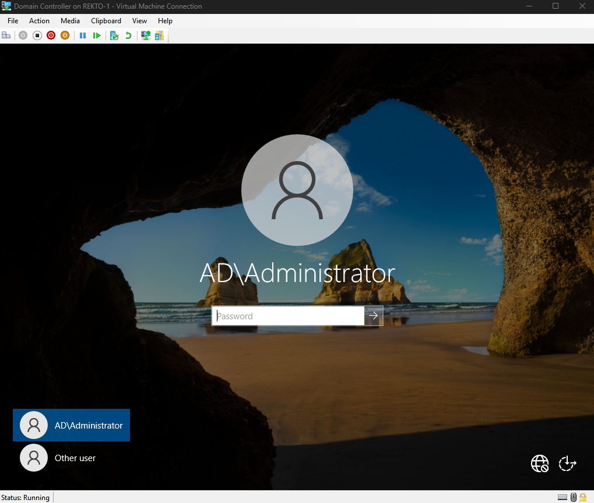
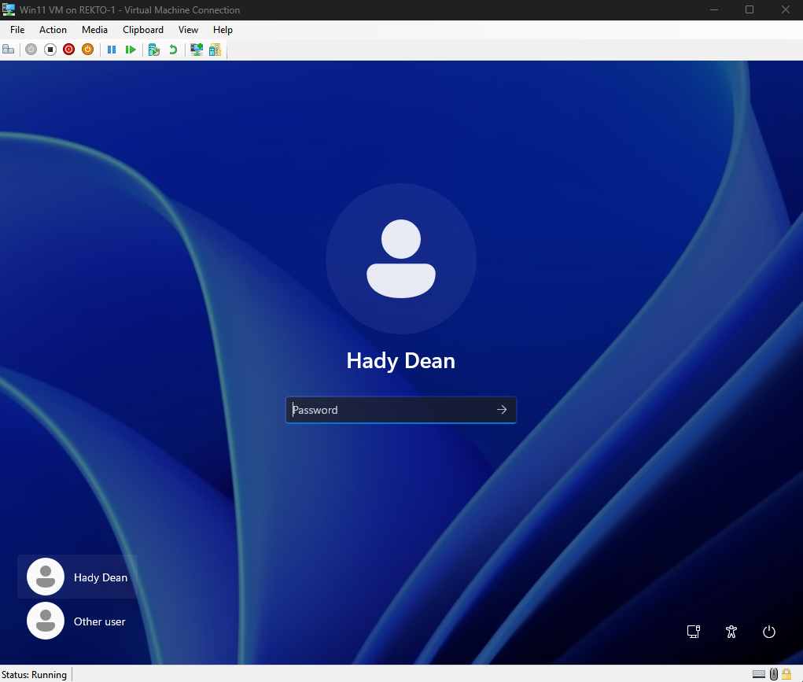

# Active Directory Virtualization Project

Starting off, here are the 3 virtual machines I setup for this project:

### My Domain Controller running Windows Server 2022

### My workstation running Windows 11

and lastly, my pfSense machine 
