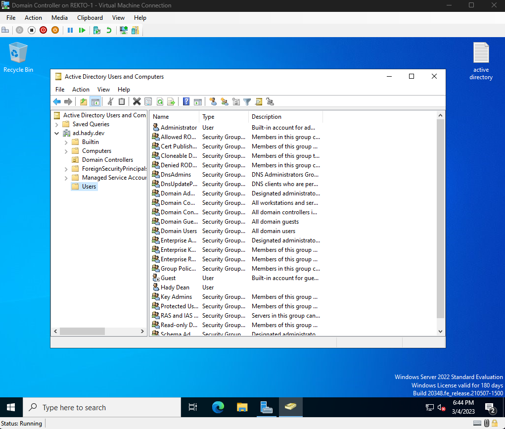
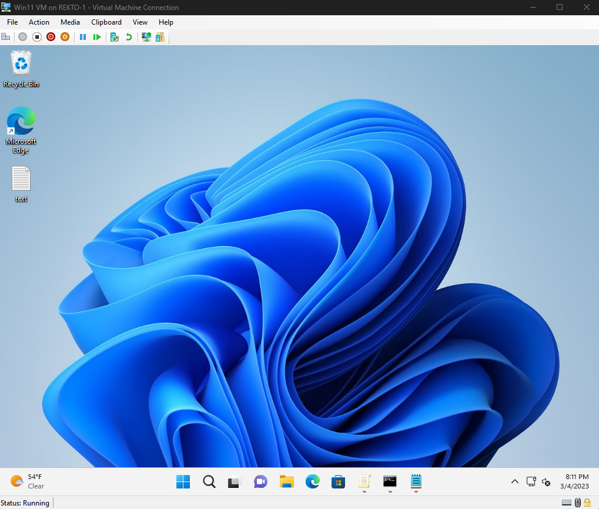
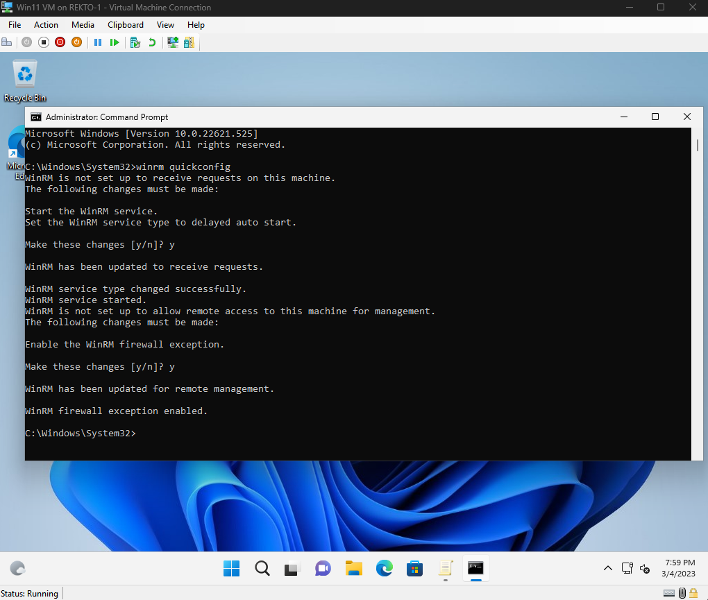

# Active Directory Virtualization Project

Starting off, here are the 3 virtual machines I setup for this project:

### My Domain Controller running Windows Server 2022

 

### My Workstation running Windows 11

 

### and lastly, my virtualized router setup using pfSense

 

### pfSense Dashboard & Adapter Setup:

 

### Connecting the Workstation to my domain:

 

### Configuring Group Policy on the Domain Controller:

 

### User Directory:

 

### Creating a text file on my Workstation from my Domain Controller using PowerShell:

 
### Enabling WinRM on the Workstation to allow remote assistance from the Domain Controller:

