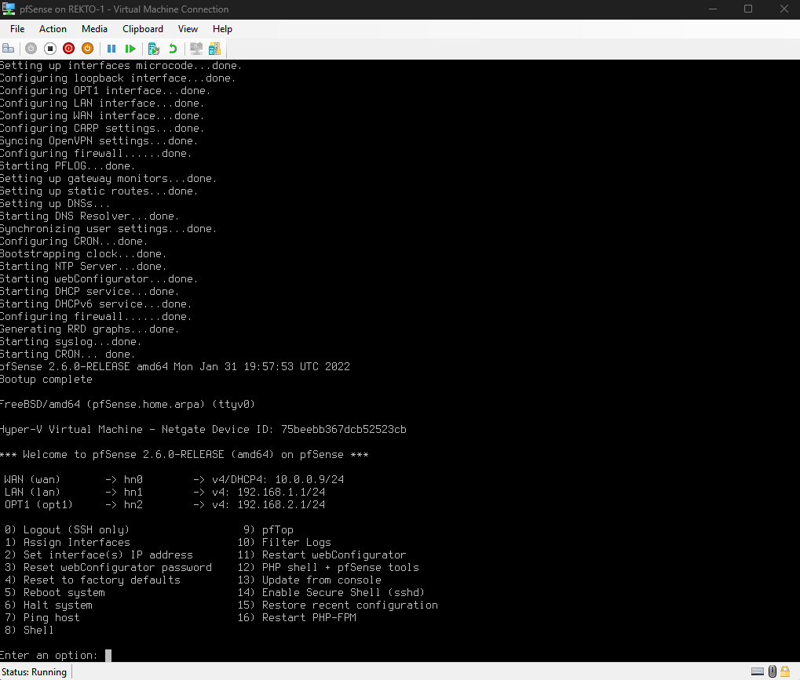
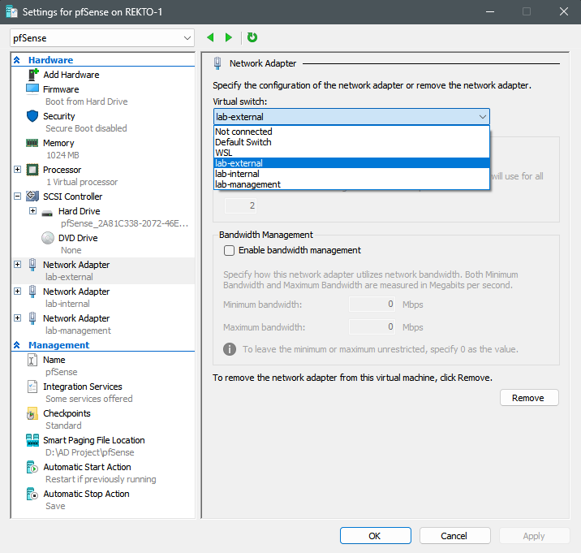
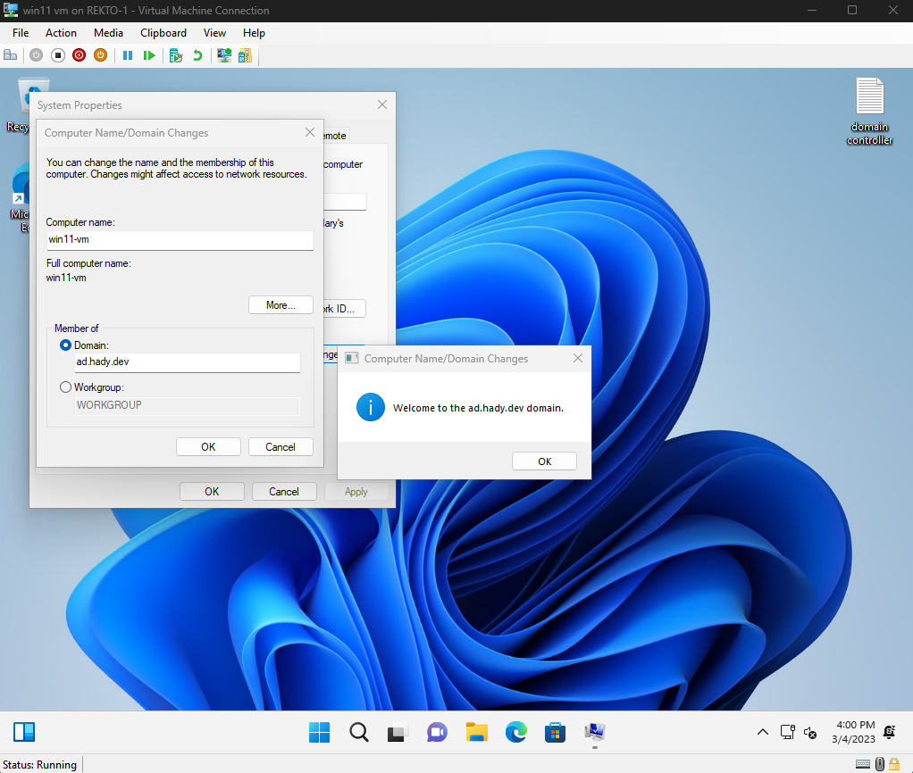
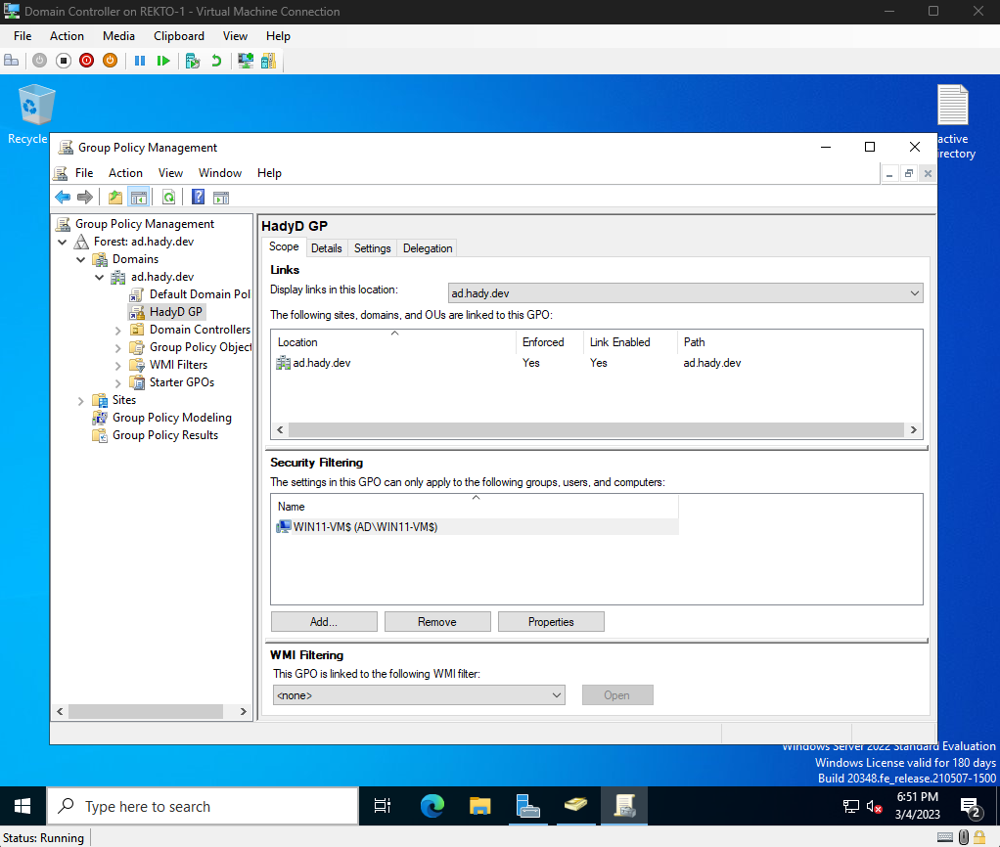

# Active Directory Virtualization Project

Starting off, here are the 3 virtual machines I setup for this project

### My Domain Controller running Windows Server 2022:

 

### My workstation running Windows 11:

 

### and lastly, my virtualized router setup using pfSense:

 

### pfSense Dashboard & Adapter Setup:

 

### Connecting the workstation to my domain:

 

### Configuring group policy on the Domain Controller:

